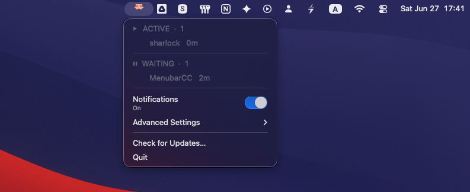
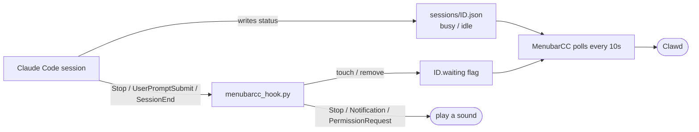

<div align="center">


# MenubarCC

**Meet Clawd — a tiny crab who lives in your macOS menu bar and shows you, at a glance, what every Claude Code session is doing.**

[](https://github.com/ksterx/MenubarCC/releases/latest)
[](https://github.com/ksterx/MenubarCC/releases)
[](#requirements)
[](#requirements)
[](LICENSE)



</div>

---

When you run several **Claude Code** sessions at once, it's hard to keep track of which one is busy, which is waiting for your reply, and which has quietly gotten stuck. MenubarCC puts all of that in your menu bar — Clawd's animation tells you the state of your work, plus a sound when a session finishes or needs you.

No window to manage, no Dock icon — just Clawd, who always knows what's going on.

## The four states

Clawd animates to match what your sessions are doing. When sessions are in different states at once, the most urgent one wins — **Waiting ▸ Stuck ▸ Active ▸ Idle** — because the only one *you* can unblock is a session waiting on your reply.

<div align="center">

</div>

<table>
<tr>
<td align="center"><br><b>Active</b></td>
<td align="center"><br><b>Waiting</b></td>
</tr>
<tr>
<td align="center">Clawd <b>walks</b> while Claude is working.</td>
<td align="center">Clawd <b>bounces</b> when Claude has finished and is waiting for your input.</td>
</tr>
<tr>
<td align="center"><br><b>Stuck</b></td>
<td align="center"><br><b>Idle</b></td>
</tr>
<tr>
<td align="center">Clawd <b>pulses</b> when a session has been busy with no updates past your threshold.</td>
<td align="center">Clawd sits <b>still</b> when there's nothing to report.</td>
</tr>
</table>

## Features

- 🦀 **Live session status in the menu bar** — Clawd summarizes every running Claude Code session in a single animated icon.
- 📋 **Session list** — click Clawd for every session grouped into **Stuck / Active / Waiting / Idle**, each with its project folder and how long it's been in that state.
- 🔔 **Notification sounds** — a chime when Claude finishes a response, posts a notification, or asks for permission. Pick your own sound per event, or mute everything from a single switch.
- ⏱️ **Stuck detection** — get a native notification when a session has been busy with no progress past a threshold you choose (5–60 min, or off).
- 🚀 **Launch at Login** — start automatically with macOS.
- ⬆️ **In-app updates** — check for, download, and install new versions without touching a DMG again.
- 🔒 **Local & private** — reads your local Claude Code session files only; the single network call is the update check to GitHub.
- ✅ **Signed & notarized** — distributed with a Developer ID signature and Apple notarization, so it opens without Gatekeeper warnings.

## Install

1. Download the latest **`MenubarCC-x.y.z.dmg`** from the [**Releases**](https://github.com/ksterx/MenubarCC/releases/latest) page.
2. Open the DMG and drag **MenubarCC** into **Applications**.
3. Launch it from Applications. Clawd appears in your menu bar.
4. On first run, MenubarCC offers to install a small hook into Claude Code (see [How it works](#how-it-works)). Click **Install Hook** — you can also do this later from **Advanced Settings**.

> The app is signed with a Developer ID and notarized by Apple, so it launches without the *"could not verify it is free of malware"* prompt.

### Requirements

- **macOS 13 (Ventura) or later**
- **Apple Silicon** (arm64)
- **[Claude Code](https://claude.ai/code)** installed

## How it works

MenubarCC never talks to Claude Code directly. It watches the status files Claude Code already writes, plus a tiny **hook bridge** it installs into your Claude Code settings.



- **Session status** comes from the `~/.claude/sessions/<id>.json` files Claude Code maintains (`busy` / `idle`, plus the working directory and last-update time).
- **The hook bridge** (`menubarcc_hook.py`, installed into `~/.claude/settings.json`) does two things:
  - Maintains a `<id>.waiting` flag so Clawd can bounce while Claude waits for you — it's set on `Stop` and cleared when you reply or the session ends.
  - Plays a sound on `Stop`, `Notification`, and `PermissionRequest` events, according to your settings.
- **MenubarCC** combines those signals every 10 seconds to decide Clawd's animation and rebuild the menu.

Installing the hook makes a **timestamped backup** of `settings.json` first, and only ever adds or removes its own entries. You can uninstall it cleanly at any time from **Advanced Settings**.

## The menu

Click Clawd to open the menu.

<div align="center">

</div>

- **Session sections** — `⚠ STUCK`, `⏵ ACTIVE`, `⏸ WAITING`, `· IDLE`, each listing the project folder and how long it's been there. Empty sections are hidden.
- **Notifications** — a master switch to mute or unmute all sounds.
- **Advanced Settings** — everything else (below).
- **Check for Updates…** and **Quit**.

### Advanced Settings

| Setting | What it does |
| --- | --- |
| **Notification Sounds** | Toggle each event (Stop / Notification / Permission Request) on or off, choose a custom sound file for any of them (`mp3`, `wav`, `m4a`, `aiff`, `aac`, `caf`), or reset back to the macOS defaults. |
| **Speed** | How fast Clawd animates — five presets from *Very Slow* to *Very Fast*. |
| **Stuck Detection** | Turn stuck detection on/off and pick the threshold: 5, 10, 15, 30, or 60 minutes. |
| **Launch at Login** | Start MenubarCC automatically with macOS. *(Requires running from `/Applications`.)* |
| **Install / Uninstall Hook** | Add or cleanly remove the Claude Code hook bridge. |

Default sounds are the ones already on your Mac — `Glass` for Stop, `Tink` for Notification, `Funk` for Permission Request. Custom sounds you pick are copied into MenubarCC's own storage, so they keep working even if you move the original file.

## Updating

Choose **Check for Updates…** from the menu. If a newer release exists, MenubarCC downloads it, swaps in the new version, and relaunches itself — no manual DMG dance. (You can always grab a DMG from the [Releases](https://github.com/ksterx/MenubarCC/releases) page instead.)

## Build from source

The app is built with [py2app](https://py2app.readthedocs.io/) for Apple Silicon.

```bash
# A dedicated conda-forge env (Python 3.13 + py2app/rumps/pyobjc/pillow/certifi)
conda create -n menubarcc-build -c conda-forge python=3.13 py2app rumps pyobjc pillow certifi
conda activate menubarcc-build

# Build the .app
rm -rf build dist
python setup.py py2app
# → dist/MenubarCC.app
```

Run from source without bundling:

```bash
python menubarcc.py
```

Producing a distributable, signed, notarized DMG involves a few macOS-specific steps (bundling `libexpat`, `install_name_tool` rpath fixes, inside-out codesigning, and notarization). The full, battle-tested release procedure lives in [`CLAUDE.md`](CLAUDE.md).

### Project layout

| File | Role |
| --- | --- |
| [`menubarcc.py`](menubarcc.py) | The menu bar app (rumps): state detection, Clawd's animation, menu, settings, updates. |
| [`menubarcc_hook.py`](menubarcc_hook.py) | The Claude Code hook bridge: maintains the `.waiting` flag and plays sounds. |
| [`setup.py`](setup.py) | py2app build configuration (version, bundled dylibs). |

## Privacy

MenubarCC runs entirely on your machine. It reads your local Claude Code session files under `~/.claude/`, and stores its own preferences under `~/Library/Application Support/com.ksterx.MenubarCC/`. The only network request it makes is the update check against this GitHub repository.

## Uninstall

1. **Advanced Settings → Uninstall Hook from Claude Code** (removes its entries from `settings.json` and deletes the installed hook script).
2. Quit MenubarCC and drag it from **Applications** to the Trash.
3. Optionally remove `~/Library/Application Support/com.ksterx.MenubarCC/`.

## License

[MIT](LICENSE) © 2026 ksterx

<div align="center"><sub>Not affiliated with Anthropic. Claude and Claude Code are products of Anthropic.</sub></div>
